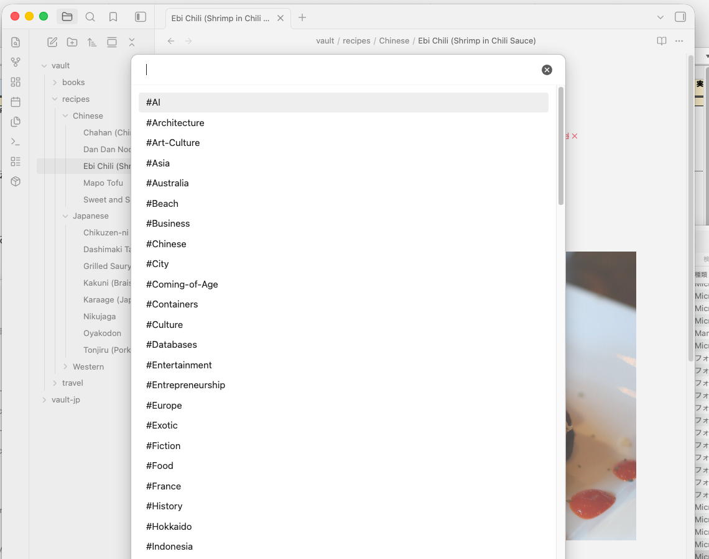
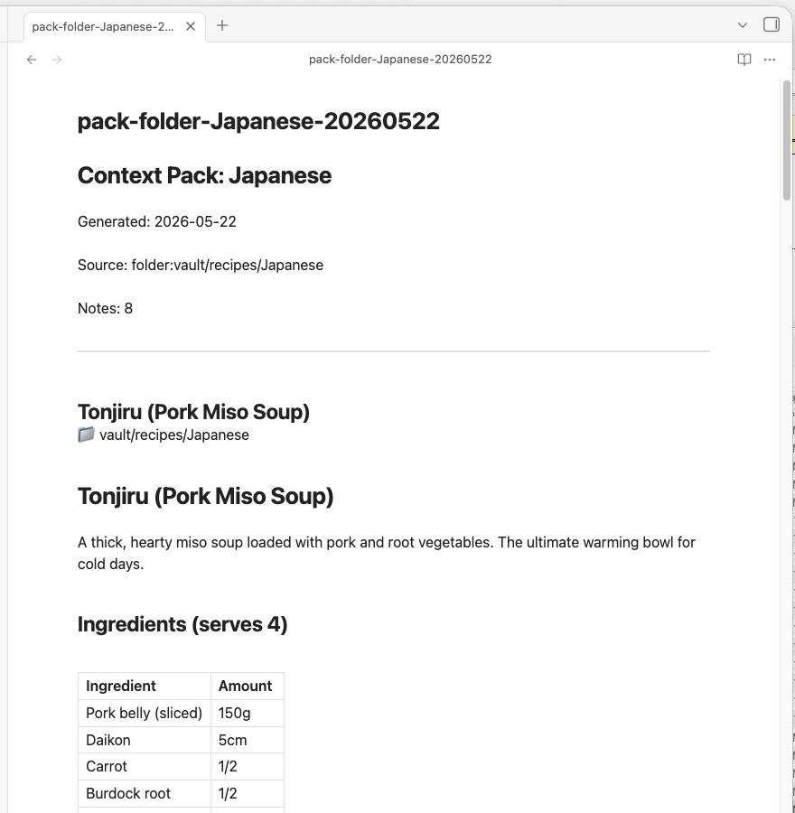

# Context Pack for NotebookLM

> Bundle your Obsidian notes into clean, AI-ready files for [NotebookLM](https://notebooklm.google.com).

---

## The problem

When you paste raw Obsidian notes into NotebookLM, the results are noisy. Broken `[[wikilinks]]`, frontmatter YAML, `![[embedded images]]`, `%%comments%%`, and `#inline-tags` all end up in the source — and NotebookLM treats them as meaningful content.

This plugin solves that.

---

## What it does

**Context Pack** bundles related notes into a single formatted `.md` file — organized by folder, tag, or MOC — and strips all Obsidian-specific syntax before export. Each note section includes its vault path so NotebookLM understands your knowledge hierarchy.

**Export** packages your notes as a clean ZIP file, ready to upload to NotebookLM as individual sources.

**Daily Notes Pack** *(v1.1.0)* collects your daily notes within a date range and bundles them into a single AI-ready file. Filter by tag, choose a preset period, or set a custom range. Supports weekly summary mode.

Both Context Pack and Export run the same formatter: frontmatter is removed, wikilinks are resolved, embeds and comments are stripped, and blank lines are collapsed.

---

## Screenshots

### Ribbon menu — access everything from one icon

### Choose a folder to pack

### Or choose by tag

### Progress dialog with cancel

### Right-click any folder in the file explorer

### The resulting Context Pack — clean, structured, AI-ready

---

## Installation

### Community plugins (recommended)

1. Open **Settings → Community plugins → Browse**
2. Search for **Context Pack for NotebookLM**
3. Install and enable

### Manual

Download `main.js`, `styles.css`, and `manifest.json` from the [latest release](../../releases/latest) and copy them to `.obsidian/plugins/context-pack-for-notebooklm/` in your vault.

---

## Usage

This plugin adds **two ribbon icons** to the left sidebar:

| Icon | Function |
|------|----------|
| package | Context Pack / Export menu — folder, tag, MOC, and ZIP export |
| 🗓↓ (calendar-arrow-down) | Daily Notes Pack — open the date range picker |

All commands are also available from the **Command Palette** (`Cmd/Ctrl+P`) and **right-click menus** in the file explorer.

### Context Pack

Bundles multiple notes into one `.md` file for NotebookLM.

| Trigger | Source |
|---|---|
| Ribbon → Context Pack (choose folder) | All notes in a selected folder |
| Ribbon → Context Pack (choose tag) | All notes with a selected tag |
| Right-click file → Create Context Pack from this MOC | Notes linked from the current file |
| Command: Create Context Pack from MOC | Same as above |

The pack is downloaded as `pack-<source>-<date>.md`.

### Export (ZIP)

Exports notes as individual cleaned-up `.md` files in a ZIP.

| Trigger | Source |
|---|---|
| Ribbon → Export entire vault (ZIP) | Entire vault |
| Ribbon → Export folder (ZIP) | Selected folder |
| Ribbon → Export by tag (ZIP) | Notes with selected tag |
| Right-click folder → Export this folder (ZIP) | That folder |
| Right-click file → Export this note (.md) | Single note |

### MOC (Map of Content)

Automatically generates a MOC note — a list of `[[links]]` to all notes in a folder or tag. Use it as an index, then run **Create Context Pack from this MOC** to pack exactly those notes.

| Trigger | Source |
|---|---|
| Ribbon → Create MOC (from tag) | All notes with selected tag |
| Right-click folder → Create MOC from this folder | All notes in folder |

---

## Daily Notes Pack

Click the **calendar-arrow-down** ribbon icon (or use the Command Palette) to open the date range picker.

**Presets:** This week / Last week / Last 7 days / Last 14 days / Last 30 days / Custom

**Folder auto-detection** tries the following sources in order:
1. Obsidian built-in Daily Notes plugin settings
2. Japanese Calendar plugin settings
3. Periodic Notes plugin settings
4. Vault scan — finds the folder containing the most `YYYY-MM-DD.md` files

If auto-detection doesn't find the right folder, click **Change folder** in the modal to pick it manually. The selection is saved for next time.

**Exclude tags** — comma-separated list of tags to exclude (e.g. `#private, #todo`). Notes containing any of these tags are skipped.

**Weekly summary** — adds a summary header (`# Weekly Summary: 2026 Week 22`) before the daily notes content.

### Commands

| Command | Description |
|---------|-------------|
| Daily Notes: Create pack (default range) | Uses the default range from settings |
| Daily Notes: Create pack (choose range) | Opens the date range picker modal |
| Daily Notes: Create weekly summary pack | Packs this week's notes with a summary header |

---

## Settings

| Setting | Description | Default |
|---|---|---|
| Output folder | Where to save ZIP exports | Vault root |
| Flatten folder structure | Merge all files into one folder in the ZIP | Off |
| Include frontmatter title | Convert `title:` and `tags:` to plain text at the top of each note | On |
| Open folder after export | Auto-open the output folder when done (desktop only) | Off |
| Custom replacement rules | Find/replace rules applied before export (plain text or regex) | — |

### Daily Notes mode settings

| Setting | Description | Default |
|---------|-------------|---------|
| Auto-detect Daily Notes | Auto-detect folder and format from plugin settings | On |
| Daily Notes folder | Folder path (manual, when auto-detect is off) | — |
| Date format | moment.js format | YYYY-MM-DD |
| Default range | Preset period for quick pack | Last 7 days |
| Exclude tags | Tags to skip (comma-separated) | — |
| Sort order | Oldest first / Newest first | Oldest first |

---

## Sample data

Want to try the plugin without setting up your vault first? Download a ready-made sample vault and open it in Obsidian.

| Vault | Notes | Download |
|---|---|---|
| 🇺🇸 English (recipes / travel / books) | 60 notes | [vault-sample-en.zip](https://s3.ap-northeast-1.amazonaws.com/assets.dualyzeai.com/obsidian-context-pack/vault-sample-en.zip) |
| 🇯🇵 Japanese（料理 / 旅行 / 読書）| 60件 | [vault-sample-jp.zip](https://s3.ap-northeast-1.amazonaws.com/assets.dualyzeai.com/obsidian-context-pack/vault-sample-jp.zip) |

1. Download and unzip
2. In Obsidian: **Open another vault → Open folder as vault** → select the unzipped folder
3. Enable Context Pack for NotebookLM in Community plugins
4. Try it — pack the `recipes/` folder, explore by tag, or build a MOC

---

## Using with NotebookLM

1. Run **Context Pack** on a folder or tag → a `pack-xxx.md` file is downloaded
2. Open [NotebookLM](https://notebooklm.google.com) → **New notebook** → **Add source** → **Upload file** → select the `.md` file
3. Start asking questions

### Sample queries — Recipes

Once you've packed your recipe notes and uploaded them to NotebookLM, try asking:

| Question | What you get |
|---|---|
| *"What can I make for dinner tonight using pork and vegetables?"* | Suggestions filtered from your notes |
| *"Which recipes take under 30 minutes?"* | Quick-cook recipes from your collection |
| *"I want something warming for a cold day. Any ideas?"* | Miso soup, stew, hot pot, etc. |
| *"Compare the ingredients in carbonara and gratin"* | Side-by-side breakdown |
| *"Give me a shopping list for making nikujaga for 4 people"* | Ingredient list pulled directly from your note |
| *"What Chinese dishes are in my notes?"* | All Chinese recipes listed |

> **Tip:** The more notes you include in the pack, the richer the answers. Try packing your entire recipe folder at once.

---

## Changelog

### v1.1.0
- **Daily Notes Pack** — bundle daily notes by date range (presets + custom), with tag exclusion and weekly summary mode
- Auto-detect Daily Notes folder from Obsidian / Japanese Calendar / Periodic Notes / Vault scan
- New ribbon icon (`calendar-arrow-down`) dedicated to Daily Notes
- Full English/Japanese i18n for all new UI
- Mobile support for Daily Notes output (saves to Vault)

### v1.0.2
- Fix content loss when a note starts with a horizontal rule (`---`)
- Fix invalid frontmatter causing parse errors on export

### v1.0.1
- Fix ENOENT error when tag names contain slashes (e.g. `project/work`)

### v1.0.0
- **Mobile support** — Context Pack and ZIP export now save directly to your Vault on iOS and Android

### v0.1.x
- Initial releases: folder/tag/MOC-based export, ZIP export, sample vaults, formatter, settings

---

## License

MIT — made by [dualyzeAI](https://dualyzeai.com)
